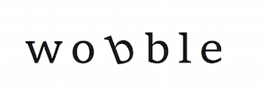

.. wobble documentation master file, created by
   sphinx-quickstart on Tue Dec  4 13:33:30 2018.
   You can adapt this file completely to your liking, but it should at least
   contain the root `toctree` directive.

*wobble* (pronounced `*(/wäb.lā/)* <https://benmontet.github.io/assets/wobble.mp3>`_) is an open-source python implementation of a data-driven method for deriving stellar spectra, telluric spectra, and extremely precise radial velocities simultaneously without reliance on spectral models.

Read the paper `on arXiv <https://arxiv.org/abs/1901.00503>`_.

Documentation
-------------

.. toctree::
   :maxdepth: 2

   quickstart
   api
   scripts
   tutorials/Recover-51Peg-RV-signal-from-HARPS.ipynb

Bug Reports & Questions
-----------------------

*wobble* is an open source project under the MIT license. The source code is available on `GitHub`_. In case of any questions or problems, please contact us via the `Git Issues`_.

.. _GitHub: http://github.com/megbedell/wobble
.. _Git Issues: http://github.com/megbedell/wobble/issues
